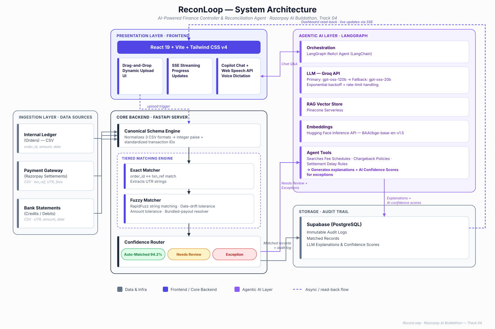

# ReconLoop

### A Multi-Source Reconciliation Agent with Explainable, Conversational Exception Resolution

**Razorpay AI Buildathon — Track 04: AI Finance Controller**

ReconLoop closes one full finance-ops loop end to end: it ingests order, settlement, and bank data from three different formats, auto-matches them through a tiered rules + fuzzy engine, and — where most tools stop at "here's a mismatch" — uses a RAG-grounded agent to explain *why* each exception happened, lets a finance user ask about it conversationally, and logs every decision to an immutable audit trail.



---

## The Problem

Reconciliation is still manual at most companies. The data lives in three systems that never agree:

| Source | What it knows | What it looks like |
|---|---|---|
| Internal ledger | order IDs, gross amounts, customer names | `order_a1b2..., 2499.00` |
| Gateway settlement | settlement IDs, fees, taxes, UTRs | `setl_k9m8..., net 2436.48` |
| Bank statement | reference strings with UTRs buried inside | `NEFT/HDFCN.../RZPPAYOUT` |

The bottleneck in 2026 is **verification capacity** — being able to trust and check output at volume. A demo that shows one cherry-picked match proves nothing.

## What ReconLoop Does

1. **Dynamic Ingestion & Auto-Detection** — Accepts heterogeneous CSV formats (Internal Ledger, Payment Gateway, Bank Statements) via a drag-and-drop UI. Uses column-pair heuristics for reliable auto-detection, with manual override capabilities. Amounts are normalized to integer paise.
2. **Matches in tiers** — exact keys first (order_id ↔ txn_ref, UTR extraction), then fuzzy (amount tolerance bands, sliding date windows, rapidfuzz reference matching, one-to-many bundled payouts).
3. **Routes by confidence** — auto-matched / needs_review / exception, with every decision written to an immutable Supabase audit log.
4. **Explains exceptions with AI Confidence** — a LangGraph agent grounds each break in tool-retrieved transaction evidence and policy documents. It produces a cited plain-English explanation along with an **AI Confidence Score** so users can take informed, risk-aware decisions.
5. **Answers questions via Voice & Text** — a conversational copilot over the same data: *"Why is this order short?"*. Includes Web Speech API integration for voice dictation, fully grounded and cited.
6. **Resilient Streaming** — Real-time Server-Sent Events (SSE) processing with graceful LLM rate-limit fallbacks so the app never crashes under load.

## Measured Results (held-out 86-event labeled batch, seed 42)

| Metric | Result |
|---|---|
| Auto-match rate | **94.2%** (81/86 events, event-level) |
| Routing accuracy | **100%** — every event landed in its expected bucket |
| Honest exceptions | **2** chargeback events — flagged, explained with citations, not hidden |
| Throughput | **~10,000 events/sec** (86 events in ~8.5 ms) |
| Edge cases handled | bundled payouts, partial refunds, rounding drift (₹0.01–₹2), duplicate IDs, 3–5 day settlement delays, reference typos, pending orders, chargebacks |

Ground truth was fixed **before** the pipeline ever ran. Per-category accuracy and the failure list are measured, not claimed — full numbers in [`eval_report.md`](eval_report.md), methodology in the report's section 7.

## Tech Stack

| Layer | Tool |
|---|---|
| Backend API | FastAPI + Uvicorn |
| Frontend | React 19 + TypeScript + Vite + Tailwind CSS v4 |
| Matching engine | Python, pandas, rapidfuzz (Decimal paise arithmetic) |
| Audit trail & matched ledger | Supabase (Postgres) |
| RAG knowledge base | Pinecone Serverless (768-d, dual-embedding namespaces) |
| Embeddings | Hugging Face Inference API — `BAAI/bge-base-en-v1.5`, fallback `all-MiniLM-L6-v2` (zero-padded) |
| Agents | LangChain + LangGraph (ReAct), Groq `openai/gpt-oss-120b` → `openai/gpt-oss-20b` fallback |
| Observability | LangSmith tracing |
| Synthetic data | Python + Faker with a hand-authored edge-case injector |

## Run It Locally

### Prerequisites

- Python 3.12+, Node 22+
- A `.env` at the project root (copy `.env.example` and fill in):

```
SUPABASE_URL=...
SUPABASE_KEY=...
PINECONE_API_KEY=...
GROQ_API_KEY=...
HUGGING_FACE_API_KEY=...
```

### Option A — Docker (one command)

```bash
docker compose up --build
```

Backend on `:8000`, dashboard on `:5173`.

### Option B — Native (two processes)

```bash
# 1. Python deps
python -m venv .venv
.venv\Scripts\pip install -r requirements.txt        # Windows
# .venv/bin/pip install -r requirements.txt          # macOS/Linux

# 2. Frontend deps
cd frontend && npm install && cd ..

# 3. Seed the RAG knowledge base (once)
.venv\Scripts\python backend\agents\vector_store.py data\policies

# 4. Run the full evaluation (generates data, matches, explains, uploads audit trail)
.venv\Scripts\python backend\eval\run_eval.py

# 5. Start backend + dashboard together
.venv\Scripts\python run_dev.py
```

Open **http://localhost:5173** — API docs at **http://localhost:8000/docs**.

### Verify the claims yourself

```bash
.venv\Scripts\python -m pytest tests/                # 121 tests
.venv\Scripts\python data\validate_ground_truth.py   # ground-truth sanity check
```

`backend/eval/run_eval.py` regenerates the labeled batch (seeded, deterministic), reruns the pipeline, recomputes every metric against ground truth, and rewrites `eval_report.md` — the honest exception list included.

## Repository Layout

```
reconloop/
├── data/
│   ├── generate_synthetic.py     # labeled held-out batch generator (8 edge-case types)
│   ├── validate_ground_truth.py  # ground-truth sanity checks
│   ├── policies/                 # RAG knowledge base documents
│   └── samples/                  # generated raw CSVs + ground_truth.csv
├── backend/
│   ├── ingestion/                # canonical schema + 3 source mappers
│   ├── matching/                 # exact → fuzzy → confidence routing pipeline
│   ├── agents/                   # Pinecone RAG, LangGraph explainer + copilot
│   ├── audit/                    # Supabase audit logger (graceful offline mode)
│   ├── eval/                     # metrics harness, markdown report, CLI runner
│   └── api/                      # FastAPI endpoints for the dashboard
├── frontend/                     # React + Tailwind dashboard & chat UI
├── docs/                         # schemas, demo script, architecture
├── eval_report.md                # generated: full measured evaluation
└── run_dev.py                    # starts backend + frontend together
```

## Design Notes

- **Money is always integer paise** — no floating-point matching errors.
- **Direction is typed, not sign-encoded** — chargebacks are positive amounts with `txn_type="chargeback"`.
- **Settlement is the bridge** between ledger and bank; they share no direct key.
- **Every agent degrades gracefully** — missing keys or API failures produce clean, honest messages, never crashes.
- **Free-tier discipline** — strict rate limiting, exponential backoff, and dual-model fallback throughout the agent layer.
