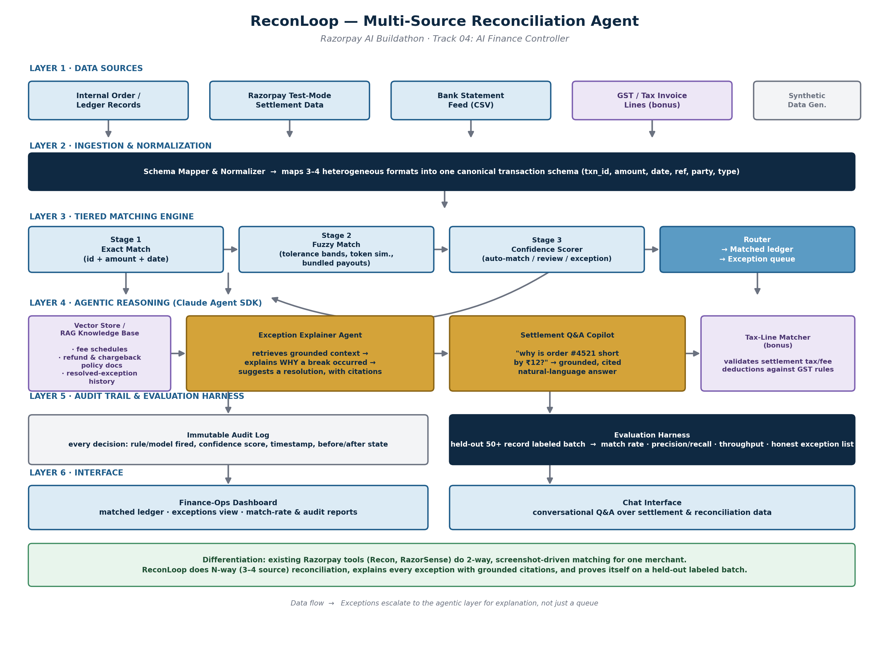

# ReconLoop
### A Multi-Source Reconciliation Agent with Explainable, Conversational Exception Resolution
**Razorpay AI Buildathon — Track 04: AI Finance Controller**

> This document is the single source of truth for this build. It captures the problem, the evaluation bar, the chosen solution, the full architecture, the data model, the evaluation plan, and a build sequence. Use it as the shared reference for yourself and any AI coding assistant working on this project — when in doubt, this doc is the spec.

---

## 1. Problem Statement (Track 04, as given)

**Track objective:** Run the books and the cash position — close one real finance-ops loop end to end, on real (synthetic) volume, not a cherry-picked demo.

**What must be built:** An agent that closes **one finance-ops loop** — reconciliation, settlement explanation, or a related workflow — operating across a **50+ record batch of synthetic data**, reporting a **match rate** and a list of **exceptions it could not resolve**.

**Why this track exists:** Reconciliation, settlement, and forecasting are still largely manual at most companies, even as generation-side AI has gotten good. The bottleneck in 2026 is **verification capacity** — being able to trust and check AI output at volume — not generation speed.

**Official example directions:**
1. Multi-source reconciliation
2. Settlement Q&A agent
3. Forward cash forecaster
4. Tax-line matcher

**Evaluation bar (what the panel is explicitly told to check for):**
- **Throughput** — does it work at volume, not just on one hand-picked example
- **Measured accuracy** — real numbers, not a claim
- **Honest exception list** — what it could *not* resolve, and why
- Explicit warning: "one cherry-picked match proves nothing" — the panel is primed to distrust demos that avoid showing failure cases

---

## 2. Why ReconLoop, Not a Simpler Reconciliation Bot

Before finalizing, we compared five directions on feasibility, business impact, fit to the evaluation bar, technical complexity, and — critically — uniqueness against what Razorpay has **already shipped**:

| Direction | Feasibility | Impact | Fit to Eval Bar | Complexity | Uniqueness |
|---|:---:|:---:|:---:|:---:|:---:|
| A. Simple 2-way bank↔settlement matcher | 9/10 | 5/10 | 6/10 | 3/10 | 2/10 — duplicates shipped products |
| B. Multi-source reconciliation, rules+ML only | 8/10 | 7/10 | 7/10 | 5/10 | 6/10 |
| **C. Multi-source reconciliation + RAG exception explainer + Q&A copilot (chosen)** | 7/10 | 9/10 | 9/10 | 7/10 | 9/10 |
| D. Standalone tax-line matcher | 6/10 | 5/10 | 6/10 | 6/10 | 7/10 — narrow, higher domain-accuracy risk |
| E. Forward cash forecaster | — | — | — | — | ruled out — already live in Razorpay's Agent Studio |

**Why Option C wins:**

Razorpay already runs two reconciliation products in production:
- **Razorpay Recon** (POS/offline retail) — an AI-powered auto-reconciliation dashboard, marketed as improving finance-ops efficiency by ~80%.
- **RazorSense "Intelligent Reconciliation"** (their new agentic merchant dashboard) — a merchant uploads a *screenshot* of a bank statement, and an agent extracts UTR numbers/amounts and cross-references them against Razorpay's own records to flag discrepancies.

Both are **two-way** (bank ↔ one settlement source), **single-merchant**, **UI/screenshot-driven** tools. A submission that rebuilds this will read as a weaker clone of something the judges already use internally.

ReconLoop is differentiated on three specific axes the shipped products don't cover:
1. **N-way reconciliation** — 3-4 heterogeneous sources at once (internal ledger, gateway settlement, bank statement, optionally tax lines), not a single bank-vs-settlement pair.
2. **Explainability, not just detection** — every exception gets a grounded, cited, plain-English explanation of *why* it broke, not just a flag.
3. **Provable rigor** — a held-out labeled batch with an honest exception list, matching exactly what the evaluation bar asks for and what most hackathon submissions will skip.

---

## 3. Solution Overview

**One-line pitch:** *ReconLoop ingests order, settlement, and bank data from three different formats, auto-matches them through a tiered rules+ML engine, and — where the shipped Razorpay tools stop at "here's a mismatch" — uses a RAG-grounded agent to explain why each exception happened and lets a finance user ask about it conversationally, with every decision logged to an audit trail and proven against a held-out labeled batch.*

**The one finance-ops loop being closed:** *Detect a reconciliation break → explain it with grounded evidence → let a human resolve it fast (or auto-resolve high-confidence cases) → log everything for audit.*

---

## 4. Architecture



### Layer-by-layer breakdown

**Layer 1 — Data Sources**
- Internal order/ledger records (what the merchant's system thinks happened)
- Razorpay test-mode settlement data (payment gateway's record of what settled)
- Bank statement feed, as CSV (what actually hit the bank account)
- *(Bonus)* GST/tax invoice lines, for the tax-line matcher extension
- A synthetic data generator produces all of the above with realistic, deliberately-broken edge cases baked in (see Section 6)

**Layer 2 — Ingestion & Normalization**
- A schema mapper takes 3-4 differently-shaped sources (different column names, date formats, currency representations) and maps them into one **canonical transaction schema** (see Section 5)
- This layer is what makes "multi-source" actually true rather than three separate two-way matchers bolted together

**Layer 3 — Tiered Matching Engine**
- **Stage 1 — Exact match:** transaction ID / UTR + amount + date. Cheapest, highest-confidence, run first.
- **Stage 2 — Fuzzy match:** tolerance bands for amount (fee/rounding drift), sliding-window date matching (settlement delay), token-based reference matching, one-to-many handling for bundled payouts.
- **Stage 3 — Confidence scorer:** combines signals from stages 1-2 into a single confidence score per candidate match, and routes each transaction into **auto-matched**, **needs review**, or **exception**.
- Industry benchmark to calibrate against: exact-only matching typically clears 40-60% of volume; a well-tuned rules+fuzzy pipeline reaches 85-95% straight-through match rates. **Target for ReconLoop's held-out batch: 80-90% auto-match rate** — credible and defensible, not an inflated number.

**Layer 4 — Agentic Reasoning (built on Claude, via the Agent SDK)**
- **Vector store / RAG knowledge base:** fee schedules, refund/chargeback policy docs, and a growing set of previously-resolved exceptions
- **Exception Explainer Agent:** for every item that lands in the exception queue, retrieves relevant grounded context and produces a plain-English explanation ("this is short by ₹12 because Razorpay's standard 2% + ₹3 fee wasn't netted out in the ledger entry") with a suggested resolution and citations back to source records
- **Settlement Q&A Copilot:** a chat interface over the same data — "why is order #4521 short by ₹12?", "how many exceptions this week are fee-related?" — grounded answers, not hallucinated ones
- *(Bonus)* **Tax-Line Matcher:** validates settlement tax/fee deduction lines against expected GST calculation rules, surfacing tax-specific discrepancies as their own exception category

**Layer 5 — Audit Trail & Evaluation Harness**
- **Immutable audit log:** every match/no-match decision records which rule or model fired, the confidence score, a timestamp, and before/after state — this is the "explainable, bounded, gated" requirement that runs through every track's bar, not just this one
- **Evaluation harness:** the actual proof-of-work artifact for the panel. Runs the full pipeline against a held-out 50+ record labeled batch and reports match rate, precision/recall on exception classification, throughput, and — critically — an **honest exception list**: what didn't resolve, and why, in plain language

**Layer 6 — Interface**
- Finance-ops dashboard: matched ledger view, exceptions queue, match-rate/audit reports
- Chat panel: the Q&A copilot, embedded alongside the dashboard

---

## 5. Data Model

### Canonical transaction schema (post-normalization)

```json
{
  "txn_id": "string",
  "source": "ledger | settlement | bank | tax",
  "amount": "decimal",
  "currency": "INR",
  "date": "ISO-8601",
  "reference": "string",
  "counterparty": "string",
  "type": "payment | refund | fee | chargeback | adjustment",
  "raw_record": "original row, preserved for audit"
}
```

### Match record (written to the audit log)

```json
{
  "match_id": "string",
  "txn_ids": ["ledger_txn_id", "settlement_txn_id", "bank_txn_id"],
  "match_stage": "exact | fuzzy | manual",
  "confidence_score": 0.0,
  "status": "auto_matched | needs_review | exception",
  "rule_or_model": "string, e.g. exact_id_amount_date | fuzzy_token_v1",
  "timestamp": "ISO-8601",
  "explanation": "filled in by Exception Explainer Agent if status = exception"
}
```

---

## 6. Synthetic Data & Evaluation Plan

This is the part that satisfies "measured accuracy" and "honest exception list" — treat it as seriously as the matching engine itself.

### Building the held-out batch (50+ records minimum)

Generate a labeled dataset where you **know the ground truth** before the pipeline ever sees it. Deliberately inject these edge cases, in roughly this mix:

| Edge case | What it tests |
|---|---|
| Clean exact matches (majority of records) | Baseline correctness |
| Bundled settlement (1 bank credit = many orders netted) | One-to-many matching |
| Partial refund / partial charge | Amount-tolerance logic |
| Fee/tax rounding differences (₹0.01–₹2) | Fuzzy amount matching |
| Duplicate transaction IDs | Deterministic matching robustness |
| Delayed settlement (date drift of 1-5 days) | Sliding-window date matching |
| Data-entry typo in a reference field | Token/fuzzy string matching |
| Legitimately pending order (no settlement yet) | Must **not** be flagged as a break |
| Chargeback/reversal entries | Exception classification |

### What to report (this becomes a slide/section in the pitch)

- **Match rate** — % auto-matched, % needing review, % true exceptions
- **Precision/recall** on exception classification (did it correctly flag the records that were genuinely broken, without over-flagging clean ones?)
- **Throughput** — batch processing time, records/sec
- **Honest exception list** — every record the system could not resolve, with the Exception Explainer's stated reason. This list should exist and be shown, not hidden. The track's own bar explicitly punishes hiding failure cases.

---

## 7. Feature List

**Core (must-have for submission):**
- [ ] Multi-source ingestion (minimum 3 sources: ledger, settlement, bank)
- [ ] Canonical schema normalization
- [ ] Tiered matching engine (exact → fuzzy → confidence scoring)
- [ ] Exception queue with RAG-grounded explanations
- [ ] Immutable audit trail for every decision
- [ ] Evaluation harness against held-out labeled batch, with reported metrics
- [ ] Dashboard showing matched ledger + exceptions + metrics

**High-value additions (strong differentiators if time allows):**
- [ ] Conversational Settlement Q&A copilot
- [ ] Tax-line matcher (4th source)
- [ ] "One failure handled gracefully" — a specific, demoable case where the system correctly identifies it *cannot* resolve something and says so, rather than guessing

**Stretch (only if core is fully solid):**
- [ ] Learn-from-correction loop (human resolves an exception → gets added to the RAG knowledge base for next time)
- [ ] Live Razorpay test-mode API pull instead of static CSV

---

## 8. Suggested Tech Stack

| Backend / orchestration | Python, FastAPI | Fast to build, good ecosystem for data + ML |
| Matching engine | pandas, `rapidfuzz` | Battle-tested fuzzy matching primitives |
| Confidence scoring | Heuristic score blend | Heuristic is faster to build and easier to explain to a panel |
| Agent layer & Orchestration | LangChain, LangGraph, LangSmith | Robust tool calling, agent state management, and built-in tracing/observability for the copilot and explainer |
| LLM | Groq API (`openai/gpt-oss-120b` primary, `openai/gpt-oss-20b` fallback) | Top-tier reasoning capability, massive speed, cost-free on Groq LPU |
| Vector store (RAG) | Pinecone (Serverless) | Fast, free tier, supports namespaces for fallback embeddings |
| Embeddings | Hugging Face API (`nomic-embed-text-v1.5` primary, `all-MiniLM-L6-v2` fallback) | Zero-cost, 8192 context length (Nomic), high precision |
| Frontend | React (or Streamlit if time is tight) | Streamlit is the faster path to a working dashboard for the demo |
| Synthetic data | Python + `Faker`, custom edge-case injector | Full control over ground truth labels |

---

## 9. Repository Structure (for the required public repo)

```
reconloop/
├── README.md                  # problem, solution, how to run, metrics summary
├── architecture.png
├── data/
│   ├── generate_synthetic.py  # produces labeled held-out batch
│   └── samples/                # example ledger/settlement/bank CSVs
├── backend/
│   ├── ingestion/               # schema mappers per source
│   ├── matching/                 # exact, fuzzy, confidence scorer
│   ├── agents/                    # exception explainer, Q&A copilot
│   ├── audit/                      # audit log writer/reader
│   └── eval/                        # evaluation harness + metrics report
├── frontend/                    # dashboard + chat UI
├── docs/
│   └── RECONLOOP_BUILD_DOC.md  # this document
└── eval_report.md               # generated: match rate, precision/recall, throughput, exception list
```

---

## 10. Suggested Build Sequence

1. **Data first.** Build the synthetic data generator and the held-out labeled batch before writing any matching logic. If you don't know ground truth up front, you can't measure anything honestly later.
2. **Canonical schema + ingestion.** Get all 3 sources normalized into one shape.
3. **Exact matcher.** Get the easy 40-60% working and logged to the audit trail.
4. **Fuzzy matcher + confidence scorer.** This is where most of the match-rate gain comes from — budget real time here.
5. **Evaluation harness.** Wire up metrics reporting early, even with a partial pipeline — this makes every subsequent change measurable instead of guessed.
6. **Exception Explainer agent (RAG).** Once exceptions are reliably identified, layer in grounded explanations.
7. **Q&A copilot.** Reuses the same RAG knowledge base and matched/exception data — should be fast to add once Step 6 exists.
8. **Dashboard + polish.** Wire the UI last, once the underlying metrics are real.
9. **Pitch prep.** Script the 5-minute video around: the problem → the architecture → live demo including a real failure case → the metrics.

---

## 11. Risks & Mitigations

| Risk | Mitigation |
|---|---|
| Synthetic data looks too clean / doesn't stress the system | Deliberately author edge cases (Section 6) before building the matcher; don't generate purely random data |
| RAG explanations sound plausible but are wrong (hallucination) | Always cite the specific source record/policy doc the explanation is grounded in; if no grounding exists, the agent should say "insufficient information" rather than guess |
| Over-claiming accuracy | Report the real number from the held-out batch, including the exception list — the track explicitly penalizes cherry-picking |
| Running out of time before the Q&A copilot / tax-matcher extensions | These are explicitly scoped as "high-value additions," not core — the core pipeline (Section 7) must work standalone first |

---

## 12. Sources Consulted

- Razorpay AI Buildathon official page — track descriptions and evaluation bars
- Razorpay Recon (POS AI reconciliation) — razorpay.com/newsroom
- Razorpay Agentic Platform / RazorSense "Intelligent Reconciliation" — razorpay.com/blog
- Razorpay Optimizer Single View Recon — razorpay.com/blog
- Industry reconciliation matching technique references (fuzzy matching tiers, confidence thresholds, straight-through match-rate benchmarks) — reconart.com, optimus.tech, highradius.com, phoenixstrategy.group

---

*This document is meant to evolve. Update the feature checklist and metrics table as the build progresses — this file, not memory, should stay the single reference point for both you and any AI assistant working on this project.*
